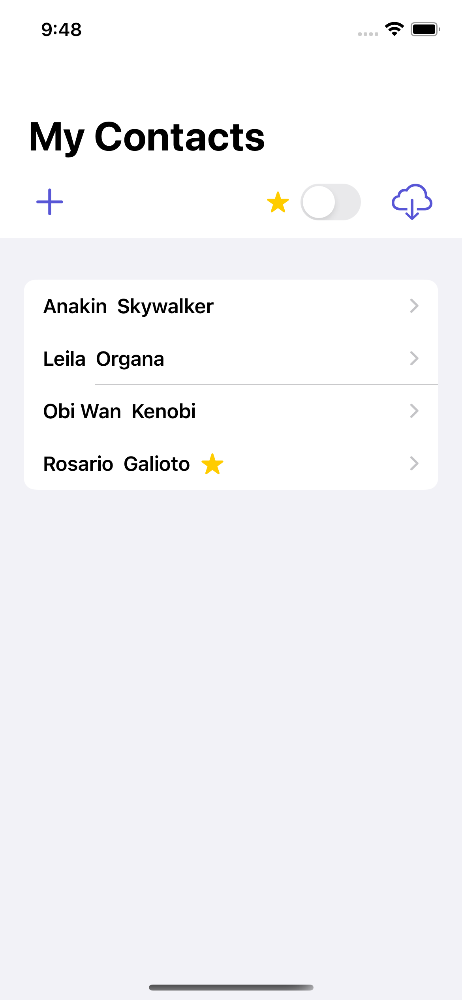
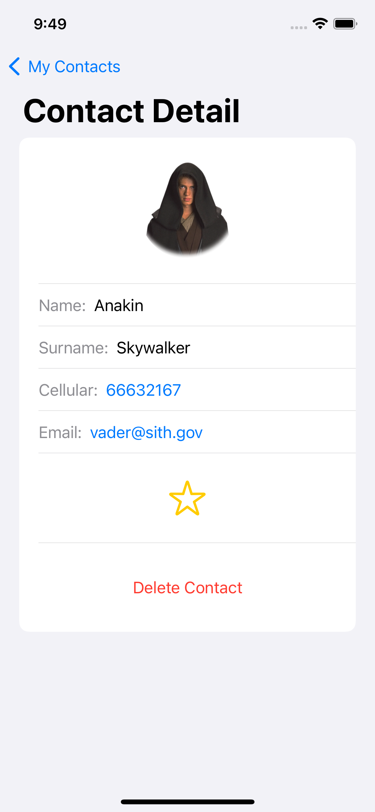
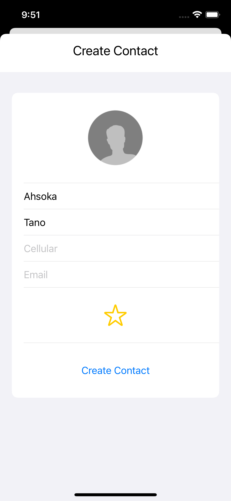

# Contacts App
### Esercizio di sviluppo App iOS con SwiftUI

L'App ha un Database interno creato con Realme, che contiene i contatti. I contatti vengono acquisiti facendo una richiesta ad una JSON API, inoltre è possibile creare i propri contatti, che verranno salvati in locale.
---

    
    
    

---